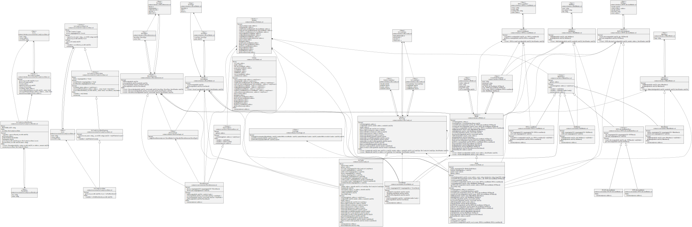

# プロダクト概要

### プロダクト名

ICE CANDY

### 概要

遊べる web3 プロフィール dApp「ICE CANDY」を開発した。
オンチェーンデータを用いたアイデンティティサービスはすでに複数存在しているが、情報をシンプルに表現しつつ、なおかつ真贋機能を備えられながらも遊べるサービスは少なかった。

そこで、オンチェーンデータやコミュニティ活動で得られたトークンや信頼を自分らしい形で表現し、コミュニケーションが促されることや健全なリアルイベント開催を目指せることにも繋がるプロダクトを開発した。デザインは世界共通で人気の「ICE CANDY」でわかりやすく表現。

### 主な機能

・オンチェーン活動履歴の可視化  
・プロジェクトオーガナイザーのための真贋機能  
・独自の「ICE CANDY」トークンの実装  
・相互に送り合うことでプロフィールが充実していくゲーム要素  
・アイスの「あたり棒」を遊び要素として取り入れゲーム的楽しさを追求  
・履歴をもとにスコアリングしプロフィールへの信頼を数値化

### 今後の展開

今後は ICE CANDY 単独だけでなく、他とプロジェクトと連携して使えるアイデンティティプロトコルへと発展させていくことを考えている。

# Product Overview (English)

### Product Name

ICE CANDY

### Copy

SWEET & TASTY PROTOCOL

### Summary

In this project, we developed "IceCandy," a playable web3 profile dApp.
Although there are already several attractive identity services that use on-chain data. There are already several attractive identity services that use on-chain data, but there were few services that can express information simply and still provide authenticity and playability.

Therefore, we developed a service that allows users to express on-chain data, tokens obtained through community activities, and trust in their own unique way, and to use them as a starting point to promote communication.
This is the starting point for communication and we developed a product that would aim to hold healthy real events.

Regardless of generation, they are a joy to receive and send. The product is expressed in a simple and easy-to-understand way using the globally popular "popsicle". The product also includes functions such as lottery and airdrop with the "lucky stick" element unique to ice cream.

### Functions

[1]Visualization of on-chain activity history
[2]Authentication function for project and event organizers Implementation of proprietary "ICE CANDY" tokens
[3]Game element in which profiles are enhanced by sending tokens to each other.
[4]The game element is a fun element that incorporates the ice cream stick as a play element, and seeks fun beyond just expressing one's history.
[5]Scoring based on the history of sending tokens to each other to quantify trust in the profile and prevent spoofing and forgery.

### Future Work

In the future, ICE CANDY will be used not only by itself, but also in conjunction with other projects.
We are considering developing ICE CANDY into an identity protocol that can be used not only by ICE CANDY alone, but also in cooperation with other projects.
In addition, we will also refine the customizability and functionality as a service that allows users to create their own unique and attractive profiles.
We also plan to refine the customizability and functionality of the service as a service that allows you to create your own attractive profile.

# 使用した TechStacks

- frontend
  - react / next.js
  - typescript
  - chakra-ui
- backend
  - solidity
  - hardhat
  - openzeppelin(ERC721, Ownable)
- external services
  - Polygon Chain
  - Alchemy SDK&API
  - QuickNode
  - IPFS
  - ENS
- protocol class diagram
  - 

# 使用した Blockchain

- Polygon mumbai

# deploy した Contract

| name                 | address                                                                                                                         | description                                                                                                                                                                                                                                                                                            |
| :------------------- | :------------------------------------------------------------------------------------------------------------------------------ | :----------------------------------------------------------------------------------------------------------------------------------------------------------------------------------------------------------------------------------------------------------------------------------------------------- |
| IceCandy             | [0x3A345Cef4a5d672BADa38f9f03fc09Eb67e70e39](https://mumbai.polygonscan.com/address/0x3A345Cef4a5d672BADa38f9f03fc09Eb67e70e39) | ERC721 IceCandy Token。send 関数を実行することでユーザー同士で IceCandy を送り合うことができる。IceCandy には not reveal,reveal,lucky,unlucky の 4 種類の token があり、IceCandy を送り合うことで token が変化する                                                                                     |
| Profile              | [0x8dD8aC17f37cb9Def8DA49D3c2f7726254f8772e](https://mumbai.polygonscan.com/address/0x8dD8aC17f37cb9Def8DA49D3c2f7726254f8772e) | ERC721 Profile Token。ユーザーの Profile 情報を NFT として表現することができる。ユーザーの情報を module として Profile に紐付けることによって Profile が充実していく。また、Profile Score によって extension が利用できるようになり、extension を使うことで自分らしい Profile を作成することができる。 |
| NFTCollectionModule  | [0xB65Ce4CbD6d41450d2613fb6Ea6eA1C836eBb455](https://mumbai.polygonscan.com/address/0xB65Ce4CbD6d41450d2613fb6Ea6eA1C836eBb455) | Profile に登録する NFT のコレクション                                                                                                                                                                                                                                                                  |
| POAPCollectionModule | [0xD00154F6FbfB8aFf378ff9c19c547EcA86dAE03b](https://mumbai.polygonscan.com/address/0xD00154F6FbfB8aFf378ff9c19c547EcA86dAE03b) | Profile に登録する POAP をのコレクション                                                                                                                                                                                                                                                               |
| SNSAccountModule     | [0x631132989cE99Ba2756aEC5949b12647d722Bc03](https://mumbai.polygonscan.com/address/0x631132989cE99Ba2756aEC5949b12647d722Bc03) | Profile に登録する SNS の Account                                                                                                                                                                                                                                                                      |
| ScoreModule          | [0x3D1bB2399937FFBB4e0797B4A57DBd8e744DCccD](https://mumbai.polygonscan.com/address/0x3D1bB2399937FFBB4e0797B4A57DBd8e744DCccD) | Profile のスコア。IceCandy を送り合うことでスコアが変化し、ユーザーの信頼として可視化される。                                                                                                                                                                                                          |
| MirrorModule         | [0x21A8a59b24eF895eC276aE4f51456E1C7c59fBab](https://mumbai.polygonscan.com/address/0x21A8a59b24eF895eC276aE4f51456E1C7c59fBab) | TBD                                                                                                                                                                                                                                                                                                    |
| SkillModule          | [0x21fa4ec52Cc2e1b99583E1EC7Ef595788beF5586](https://mumbai.polygonscan.com/address/0x21fa4ec52Cc2e1b99583E1EC7Ef595788beF5586) | Profile に登録するスキル                                                                                                                                                                                                                                                                               |
| FlavorExtension      | [0x27CF00F8db84C858a7cF13b73aC73d11DD03b73f](https://mumbai.polygonscan.com/address/0x27CF00F8db84C858a7cF13b73aC73d11DD03b73f) | 特定スコアを超えると付与される extension。IceCandy のように Profile にフレーバーをトッピングすることができ、よりオリジナリティのある Profile を作成することができる。                                                                                                                                  |
| Globals              | [0xD839A705C651c5Ff4441D17D24c4523429b90013](https://mumbai.polygonscan.com/address/0xD839A705C651c5Ff4441D17D24c4523429b90013) | 各コントラクトのアドレスを管理するコントラクト。                                                                                                                                                                                                                                                       |

# サービス URL

https://icecandy.io

[使い方](https://code4japan-community.notion.site/IceCandy-6a76fd525b434751929ee98b6c068c09)
